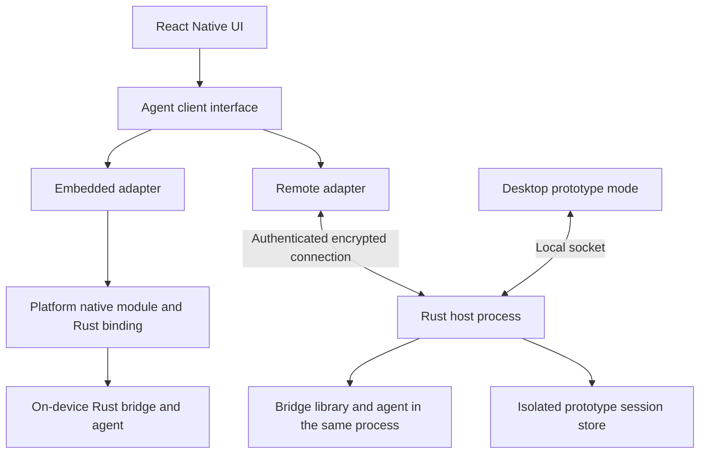

# Mobile architecture and security

Status: proposed, not implemented. The [overview](README.md) records existing code findings; the [client contract](client-contract.md) and [implementation plan](implementation-plan.md) define the prototype.

This is a high-level starting plan, not an exhaustive account of edge cases or behavior. Expect implementation discoveries to change or add to it. Update the affected design, specs, and tests as those decisions are made; resolve security gaps before enabling the affected feature. See the [executive summary](executive-summary.md) for the full proposal in one document.

## Execution targets

Use React Native for the mobile UI and one TypeScript session interface with embedded and remote adapters. Prove the interface first with a client on the local host machine driving the existing stdio RPC process, with a bounded embedded exercise proceeding independently of the host track.

Every session belongs to one execution target. Keep the target visible in the session list, composer, and approval views. Switching targets selects or creates another session; it never moves live execution, copies permission grants, reinterprets paths, or falls back to executing on another device.

Agent execution and model inference are separate choices. An agent on the phone may call a remote model service. Neither offline operation nor on-device inference is promised. Sessions, tasks, targets, and capabilities are the common vocabulary; Git projects and coding tools are capabilities rather than assumptions about every future mobile task.

## React Native and embedded execution

Put thin TypeScript adapters, wire types, client-local UI state, and fixtures in the standalone `packages/agent-client/` package. Shared session behavior, approval semantics, and reusable presentation transforms live in Rust and reach both execution modes through the [shared view contract](client-contract.md#shared-screen-state). The TypeScript package's build and local test program run independently of Electron. React Native consumes that package directly; Electron integration comes later for desktop handoff. Keep Node, DOM, Electron, and JNI APIs outside that shared library. Use the existing WebView layouts and interactions to inform native views; React DOM/CSS components need adaptation for React Native.

Use React Native for native mobile controls and shared Android/iOS screens. The [UI decision](decisions-and-tradeoffs.md#1-react-native-for-both-mobile-modes) records the alternatives and requires device validation of responsiveness, input, scrolling, accessibility, approval display, and lifecycle handling before expanding the screens. Neither platform has delivery priority; select the first device proof based on integration effort and available hardware, and track tested platform coverage.

A narrow React Native native module reaches the Rust runtime through a platform binding. Android can draw from the Rust/JNI prototype on [android-shell](https://github.com/brave/bravebot/tree/android-shell), pinned to [`9635f16b`](https://github.com/brave/bravebot/tree/9635f16b49798624e6174b0d15818227773e81a8). This integration provides a foundation for stage 2b. Review ongoing branch progress as described in [Current mobile status](README.md#current-mobile-status), then bring selected code and relevant checks onto current main. The existing Node checks cover source consistency and layout, not JNI or Kotlin runtime behavior; stage 2b adds native integration coverage. iOS needs a separate binding. Typed native-module specifications and platform bindings provide the integration mechanism, not an existing Bravebot adapter. See [React Native native modules](https://reactnative.dev/docs/turbo-native-modules-introduction).

The embedded proof is foreground-only: one session, app-private storage, a turn, and one supported question or approval. Test denial, cancellation, and labelled presentation on that path. Audit existing tools to choose it; missing command confinement must continue to refuse commands. Do not add a phone network server or desktop command parity to satisfy the common interface.

Start the embedded runtime only for an explicitly selected on-device session. Remote-only use must not start it. Device credentials and state remain separate from paired-host credentials. Runtime teardown must explicitly stop/refuse pending work; losing a JavaScript listener alone does not prove execution stopped. After app/runtime loss, report interruption or uncertainty without replaying effects. Broader device tools and background services are later work. Passing on one platform does not establish support on the other.

## Rust sharing boundary

Reuse the existing Rust crates for execution, permissions, model-provider access, session lifecycle, and projection. The local proof needs only the view of its supported events; recovery and takeover arrive in later stages. The [client contract](client-contract.md#shared-screen-state) defines the additive view capability, compatibility behavior, and thin TypeScript adapters. Transport validation can reject malformed input early; the execution owner enforces policy.

Keep inspection of released content in a separate presentation layer permitted by [LAYER-1](../../specs/layering.md#LAYER-1). The bridge is currently a non-presentation crate that carries labelled payloads without inspecting them. The proposed session projection must preserve that boundary. Reuse suitable Rust presentation helpers or extract a narrow presentation crate with its first caller and required spec changes. Do not put content inspection in bridge dispatch, `bravebot-core`, or `bravebot-agent`. Presentation outputs are for display and cannot determine execution or enter planner input.

## Embedded model credentials

The first embedded proof uses a controlled model stub and needs no production credential. Before enabling a real backend on a phone, add a native credential provider to the existing Rust backend/configuration path, governed by [backends](../../specs/backends.md) and [credential protection](../../specs/credential-protection.md). Extend that path instead of implementing model authentication or requests in JavaScript. Mobile storage is proposed work; existing desktop credential files do not establish it.

For the first real-backend exercise, support one explicitly configured gateway and a separately issued, revocable credential entered by the person on that phone. Bind it to the confirmed endpoint; changing the endpoint requires new confirmation and credential setup. No host credential transfer, credential in an app bundle, or import from a chat or workspace. Other backend login flows wait until they have their own supported mobile path.

Keep credential values out of JavaScript state and process-wide environment variables. Return only an opaque configuration ID and status to the UI, and supply the secret directly to Rust for the intended backend request. Preserve the Rust credential-buffer protections and refuse real-backend use where the platform cannot meet the governing requirements.

Native secure entry, the storage settings below, device authentication, and stopping embedded work on lock/background are the initial design to test under [Q3](open-questions.md#q3-how-are-embedded-api-keys-set-up-stored-and-revoked-after-device-loss). Their mechanisms are provisional. Device evidence may justify a different mechanism that meets the same secret-protection requirements and the foreground-only prototype scope. Record the choice and update the affected lifecycle checks before enabling real credentials. Until then, use the controlled model stub.

- **iOS:** use a non-synchronizing Keychain item with `kSecAttrAccessibleWhenPasscodeSetThisDeviceOnly`. It requires a passcode and unlocked device and does not migrate to another device. See [Apple's accessibility rules](https://developer.apple.com/documentation/security/ksecattraccessiblewhenpasscodesetthisdeviceonly).
- **Android:** encrypt the credential in app-private storage with a non-exportable [Android Keystore](https://developer.android.com/privacy-and-security/keystore) key requiring device authentication. Exclude the encrypted record from backup and device transfer. Treat invalidated keys or unavailable secure storage as requiring setup again, with no plaintext fallback. The Keystore protects the encryption key; the model credential must still enter Rust memory when used.
- **Lifecycle:** stop embedded work on lock/background, refuse pending questions, and clear owned credential buffers on teardown. Do not store secrets in transcripts, snapshots, logs, crash reports, URLs, or pending-send records. [React Native's security guidance](https://reactnative.dev/docs/security) identifies Async Storage as unencrypted and unsuitable for secrets.
- **Removal and loss:** provide a local remove action that stops affected work and deletes the stored credential. Reuse Rust's credential-revocation record for the issuer, exact external revocation route, and any derived credentials that survive revocation, as CRED-25 requires. Local deletion and uninstall do not revoke a provider key. After device loss, revoke it at the provider and separately revoke host pairing on the host; neither action substitutes for the other. Do not promise remote erasure of content already on the phone.

Keep model credentials and pairing credentials in separate records and APIs. Remote-only mode uses host pairing without reading the phone's model credentials. Before a real-backend demo, test lock/relaunch, invalidation, deletion, backup/restore, endpoint changes, separation from pairing, and exclusion from captured logs and planner requests using test credentials. Record provider-side revocation evidence separately from local deletion.

## iOS capability and distribution limits

**Remote control:** the agent and tools execute on the user's host. The phone's iOS sandbox does not constrain tool execution on that host; host permissions, command confinement, pairing, and session authorization still apply. The phone client remains subject to iOS rules for its own storage, networking, and lifecycle.

**On-device agent:** the agent and tools execute on the phone and must respect the iOS sandbox and applicable platform rules. The first iOS embedded target is a foreground app with a Rust runtime, an app-private workspace, and a small set of compiled-in tools. For this on-device proof, exclude shell commands, downloaded executables, package installation, and arbitrary filesystem access. These exclusions do not limit tools running on the remote host. An unsupported tool returns a defined refusal. A model call may use the network; neither a local model nor desktop tool parity is required. The OS sandbox remains binding in development builds: [Apple's runtime security guide](https://support.apple.com/en-gb/guide/security/sec15bfe098e/web) limits cross-app access to platform-provided services.

Apple's [App Review Guidelines](https://developer.apple.com/app-store/review/guidelines/) constrain downloaded/executed code in 2.5.2 and background services in 2.5.4. TestFlight also requires guideline compliance under 2.2. These are constraints to check against the enabled tools, not evidence that this app will be accepted. Start hardware proofs with developer-installed builds and record the distribution method. Before TestFlight or App Store submission, review the actual tool list, entitlements, third-party SDKs, privacy disclosures, and backend/account flow against the current rules.

Remote mode needs a separate distribution check too. Guideline 4.2.7 includes a LAN restriction for certain remote desktop clients. Whether this session-control app falls within it needs review before promising App Store distribution of away-from-home control. Do not assume a remote-only build settles that question. If an embedded capability or distribution route remains unsupported, publish the narrower tested capability matrix and keep that milestone incomplete. The local host/client work can proceed independently. These platform references were checked on 5 October 2026; check the current rules again before distribution.

## Host topology decision

The persistent host is one Rust process that owns the bridge library and listens on a socket. Add a listener entry point or mode beside the existing stdio transport in `crates/ui-bridge`; exact binary naming is an implementation choice. Preserve the existing stdio behavior for direct clients and the first local test.

The listener, session registry, display projection, and bridge share that process. There is no separate supervisor wrapping an RPC child. This removes child replacement, uncertain child liveness, and a second execution generation from the prototype. A host-instance ID changes on every host restart. Embedded runtimes have their own instance identity.

A host crash interrupts its live sessions and connection handling together. Restart does not claim continuation of in-flight work or undo completed effects. The agent may still start tool processes; removing the RPC child does not remove tool shutdown responsibilities. Use existing cancellation/confinement behavior and report unresolved effects honestly.

Initially use a foreground process and a private local socket. Keep session dispatch independent of transport so a development transport can support the stage-3d phone experiment. Later add authenticated encrypted networking to the same owner. Network loss must not end the host; automatic service startup and recovery are optional follow-ons. Reflect the new listener and presentation responsibilities in the layering spec alongside implementation.

## Local control boundary

A same-user socket is reachable by other programs running as that user, including unconfined commands approved through Bravebot. Directory permissions and peer credentials do not prevent such a command from taking control or answering later approvals. A bearer token readable by those programs does not solve that problem either.

Before stage 3b enables live-session control, record the control-channel authentication and isolation decision, its limits, and an adversarial test using a child command that attempts to connect and answer, including after detaching from its parent. Peer-credential checks alone do not cover this case. Evaluate the candidate boundaries and reconnect costs in [U1](open-questions.md#u1-local-control-channel-boundary); none is established by this plan. Do not claim that approval of one command authorizes future session control. Until a boundary that excludes tool processes is demonstrated, restrict listener experiments to synthetic data and a controlled model/tool stub, with no real untrusted commands, credentials, or private workspace data. Apply the same decision to desktop attachment and network listener backends. General same-user malware resistance is not a prototype claim.

## Session storage and ownership

Use an isolated prototype session store, separate from ordinary desktop/terminal session discovery and resumption. Use a host-startup override for the sessions root only, covering session list/load/save paths; keep settings, trust stores, and credentials at their normal locations. Amend the sessions spec alongside that implementation. Introduce this explicit storage boundary; do not casually change `HOME`, which also affects credentials, settings, and tools. The desktop prototype mode accesses these sessions only through the host. Disable saved-record import and direct open-by-path in the prototype API.

Isolation is a release condition before desktop integration, not a UI convention. Test that normal supported desktop/terminal list and resume paths cannot open a host-owned prototype record, including an explicitly supplied record ID. If the chosen storage boundary cannot enforce this, add cooperating exclusion to all supported writers before proceeding. Do not ship a shared-store design with only a warning not to resume elsewhere. This protects supported front ends; it does not claim isolation from malicious code running as the same OS user.

Within the host, one registry maps target-qualified live IDs to existing bridge handles. Repeated attachment finds the same live session. A record ID is not evidence that saving succeeded: `Handle::save` currently returns no success result. Keep saved progress unknown unless independently confirmed; recover only records actually present after restart, and only if later resumption is supported.

Separate detach, cancel, and close. Detach removes a client subscription. Cancel targets an exact turn. Close acknowledges `closing`; only confirmed worker termination establishes `closed`. Save outcome remains unknown unless separately confirmed; a `finished` flag or final event alone is not worker-completion evidence. Retain ownership until that point or confirmed process exit. If completion cannot be established, refuse a replacement writer. Cancellation never implies rollback.

## One controller and explicit takeover

Allow one active controller per session plus authorized read-only viewers. Read-only grants cannot send, answer, cancel, close, or take control. A viewing client with control permission may explicitly request takeover; the host changes the controller identity/epoch atomically and notifies all attached clients. No implicit takeover occurs on reconnection.

Old-controller commands must fail after takeover even if its socket is still open. Validate controller identity with the action's exact session, turn, and question target when applying it. A duplicate takeover with a stale expected epoch fails rather than taking control back. A new controller becomes ready only after current control state and its subscription are established.

Pending questions may be handed over during explicit takeover while the old controller is still available. Use the new connection’s own fixed answerable kinds, never the former controller’s capabilities. On controller loss, refuse pending questions; reconnection cannot revive them. If no ready controller can answer a kind, refuse that question. Startup trust remains unanswered and blocks turns until a person answers on the host.

Host-only approvals require a capable host-local controller. The stage-5a test client supports startup trust; other host-only kinds require a UI that can render and answer them, such as the later Electron integration. Takeover is explicit and uses the same controller state; there is no second hidden approval channel. The host determines which kinds a connection may answer, regardless of what the client advertises.

Do not implement shared follow-up queues for the prototype. Sending during an active turn returns busy; the UI retains an unsent draft. Concurrent controllers, shared queue order, and competing-approval features are optional later work. Multiple execution owners for one session remain prohibited. Stale-action rejection across handoff is still mandatory.

## Target checks and controller loss

Prefer session-wide non-reused question IDs, qualified by runtime instance and session, over a second token scheme. Allocate and consume them atomically, reject counter exhaustion, and retain kind validation. Add expected-turn validation to cancellation; legacy direct callers may omit it, but the host must supply it. Accept startup trust only while the session awaits its first answer, consuming that state once before any blocking lock. Reject repeats without replacing the trust map or blocking cancellation. A separate trust token is needed only if implementation reveals an ambiguity the state check cannot resolve. Update affected callers and tests explicitly.

Local mode uses ordered attach/readiness/detach transitions and answerable kinds fixed for each connection. Disconnect clears availability. Registration, answer consumption, and refusal share coordinated state; a late question event cannot resurrect a resolved question. No network heartbeat/lease subsystem is needed for the first local socket. If the UI can no longer present questions, it must report not-ready; an open connection alone is insufficient.

Before network use, add finite readiness expiry for half-open connections and backgrounded phones. Choose durations during implementation and test the boundary. No timeout grants permission. A foreground phone is required when the remote demo expects an approval; lock/background without another ready controller causes refusal, and the turn may continue without the refused effect. Bounded waiting and notifications are a later policy/product decision, not an existing promise.

## Display and reconnect

The host owns the display projection, using the shared Rust view implementation from the stdio and embedded paths to process accepted user submissions and bridge events. Include prompt rows, message IDs, running/closing state, trust questions, approval resolutions, and terminal outcomes. Existing renderer-local prompt insertion is insufficient for multiple viewers. Match optimistic client rows by message ID.

Order state changes and display events through one host sequence. Publish a turn’s terminal event before accepting the next turn; serialize that transition with dispatch. Terminal-event publication and the `finished` update must form one transition as observed by dispatch. A valid send issued immediately after observing the terminal event must be accepted when the session remains open and no competing turn has started. Reordering emission and the flag store without synchronizing the busy check is insufficient; test this boundary with explicit synchronization. The shared Rust view follows this authoritative order; clients apply its status updates without a second busy-state reducer. Stage 3 provides current control state at a subscription boundary before allowing control. Stage 4 adds a bounded recent-history snapshot. Reconnect or a sequence gap fetches a fresh snapshot; incremental replay is deferred. Never recover a live session by reopening its saved record.

Bound history, messages, and client buffers. Show older-history omissions. A capped snapshot is sufficient; pagination is optional. Preserve full approval details outside evictable history; if they exceed supported bounds, refuse remote approval rather than summarize away the decision. Slow viewers must not block the agent. Carry labels through live events and snapshots. Display projection must not inspect untrusted content to decide execution.

## Permissions and effective scope

The driver and planner never have untrusted content in their context. The driver may carry untrusted content but may not branch on its bytes. Presentation is not permission to feed displayed content back as trusted instructions. Keep existing policy gates authoritative in both modes.

Pairing grants device access, not agent-effect approval. Authorize read and control separately for the session's full effective scope before exposing content. Scope sources include project and additional directories; trust-map and remembered-trust entries; trusted programs; effective permission rules from settings layers and selected overrides; permission modes and auto-vetting; and any session-lived exposure grants. Use resolved agent/config state, not a second interpretation of configuration prose; a single scope API does not yet exist. A fresh session can inherit standing permissions.

The host project-ID table comes only from the person's host configuration, never checkout-controlled files. Check scope on creation/attachment and when effective session authority changes. A changed settings file matters when it is applied; do not assume file edits instantly change an open session's resolved rules. Suspend remote reads/control before a widened scope becomes visible until explicitly authorized on the host.

For the first remote demo, require workspace trust and scope-expanding answers on the host. Phone replies are restricted by kind and field in the client contract. No remembered grants or silent trust derived from pairing. If the phone cannot answer a question, explain the limit and allow desktop takeover; do not infer approval.

Before network access, explicitly authorize private-content transmission to the paired destination and reconcile it with presentation/egress policy. Labels, pairing, and encryption alone do not define destination authorization. Authenticate requests/subscriptions, verify host identity before sending credentials, revoke active access, and validate browser origins where applicable. Keep credentials out of transcripts and ordinary URLs.

## Decisions before authenticated networking

Stage 6 needs two short decision notes, based on the local implementation. Track their status as [U2](open-questions.md#u2-pairing-and-transport-identity) and [U3](open-questions.md#u3-effective-session-scope):

- **Pairing and transport:** host identity verification/pinning, device credential creation and storage, revocation, backend access, origin checks where relevant, pre-authentication size/time/connection limits, and authorization to display private content. Tailscale is reachability only unless a separately tested identity boundary is chosen; a directly reachable backend must not trust forgeable proxy identity headers.
- **Effective scope:** map each scope source above to resolved state and the transitions that change it. Permission rules are read at open, but some settings are read each turn. Capture initial grants and enumerate authority-changing host replies and revocations; check per-turn settings for relevant changes. Reauthorize before widened access. Do not suspend access for every ordinary write or one-use command decision, and do not leave applied settings outside the check as an undocumented gap.

Keep these notes short and testable. Pairing details that determine identity or authority are security decisions, not routine library choices.

## Limits and tradeoffs

| Choice | Benefit | Limit |
|---|---|---|
| Direct Rust host | Reuses the bridge without an extra execution process boundary. | Host failure loses connections and live execution together. |
| One controller, viewers, explicit takeover | Demonstrates desktop-to-phone continuation with less coordination. | Busy turns reject follow-ups; no shared queue. |
| Isolated prototype store | Avoids changing ordinary record resumption before proving mobile. | No import or normal-session-list integration; isolation must be tested. |
| Message-ID send protection | Prevents duplicate turns without a generic retry subsystem. | Other uncertain mutations are not automatically retried. |
| Foreground approvals | Retains refusal when nobody can answer. | Locked-phone work may skip requested effects. |
| React Native with a shared Rust view | Supports embedded and remote execution without duplicating session behavior. | Native views and platform integration still need tests. |

Keep the ordinary desktop path for features not supported by prototype sessions. Publish a capability matrix and disable unsupported controls there. Bots, attachments, forks, watches, manifests, settings/hooks editing, file browsing, exports, saved import, and full desktop parity are not required. Direct desktop behavior is not automatically fixed by host-mode controller handling; its existing crash/lifecycle limits remain unless explicitly changed and tested.
