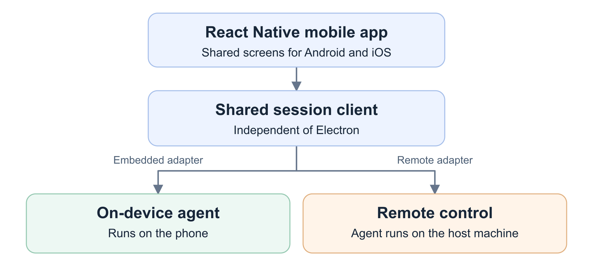
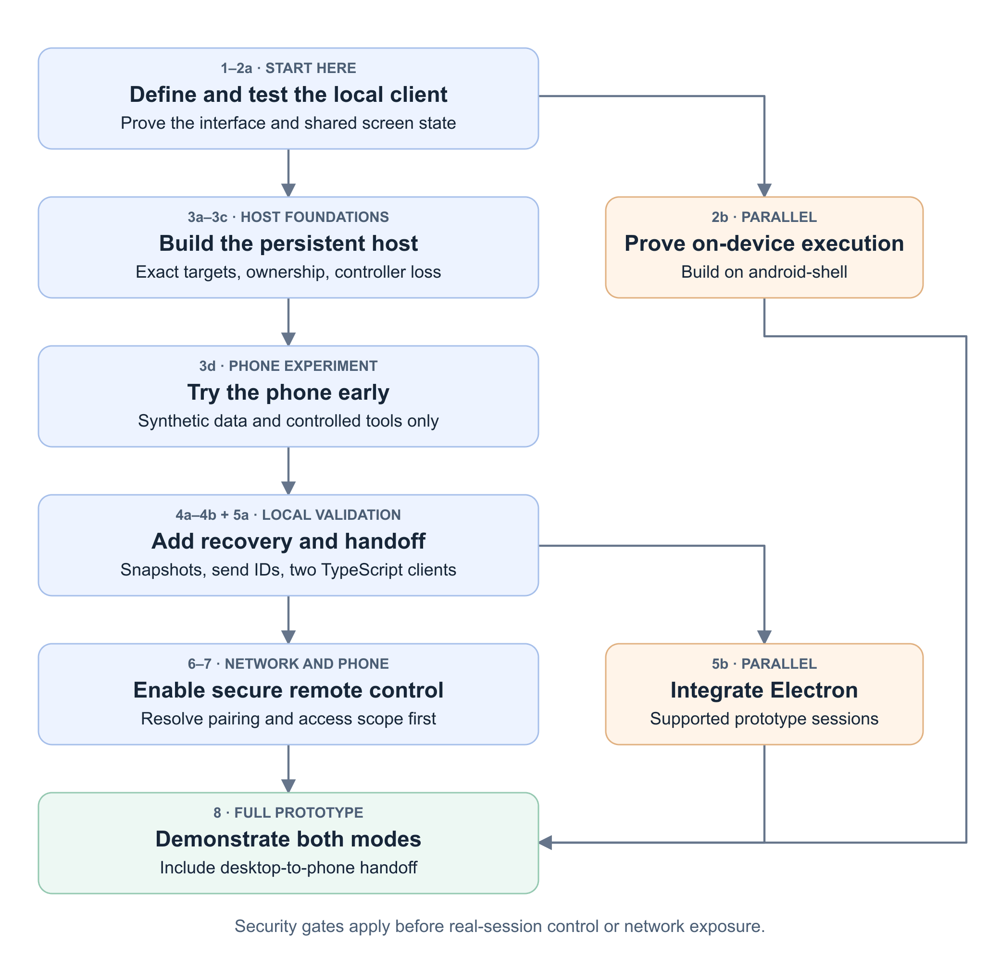

# Bravebot mobile: executive summary

Status: the first Rust session-view block is implemented. The TypeScript client and later mobile stages remain proposed. See [current local scope](client-contract.md#implemented-rust-block).

## Two modes in one app

- **On-device agent:** Bravebot runs on the phone, using its available tools, files, and permissions. It may still call a remote model service; offline inference is not promised.
- **Remote control:** the phone starts sessions, reads progress, sends follow-ups, answers supported permission requests, and cancels turns running on the user's host machine. The host owns execution and state when the phone disconnects.

Each session stays with its chosen execution target. Switching targets never moves live work or transfers permissions. Coding is an initial proving task; both modes should support other useful work.

## Why React Native

The prototype uses React Native for native mobile controls and shared Android/iOS screens. Validate responsiveness, approval legibility, accessibility, keyboard behavior, scrolling, and lifecycle handling in the first device proof before expanding the screens. The unmerged WebView prototype supplies a reference for reusable integration code; it does not determine the mobile UI architecture. See the [UI decision](decisions-and-tradeoffs.md#1-react-native-for-both-mobile-modes). Neither platform has delivery priority.

Keep shareable behavior in Rust. Both execution modes call the same Rust session-view and approval code; the thin TypeScript package in `packages/agent-client/` handles transport and UI wiring. Validate the new view capability through a real local RPC process, independently of Electron.

## Implementation order

**Remote control is the first substantial end-to-end prototype.** Test the interface locally first, discover phone lifecycle problems early, then add recovery and secure networking. Embedded work proceeds in parallel; Electron integration does not block the initial phone work. Both remain part of completion.

Use **red → green → refactor** for each small behavior: show the intended test failure, implement it, then improve the code with tests passing. Follow `testing-preflight` and demonstrate that selected security and concurrency tests catch plausible faults.

The first deliverable is the local client proof. The [first secure remote checkpoint](implementation-plan.md#first-secure-remote-checkpoint) then uses a local test client for host setup and takeover; embedded work and Electron attachment can follow. Both remain required for full completion. Use the [checkpoints and scope cuts](implementation-plan.md#checkpoints-and-scope-cuts) to choose the next deliverable based on demonstrated behavior and remaining work.

## Current mobile status

The [android-shell](https://github.com/brave/bravebot/tree/android-shell) branch contains an unmerged proof of concept with:

- On-device Rust execution through JNI and an Android app using the renderer in a WebView.
- Phone navigation, drawers, sheets, and touch-layout work.
- Host input checks, source-consistency and layout tests, and build guidance.

Build on this work when implementing native integration and mobile interactions. Review branch progress before stage 2b and later work that uses it, record the selected revision, and preserve contributor attribution.

The current source reference is [`9635f16b`](https://github.com/brave/bravebot/tree/9635f16b49798624e6174b0d15818227773e81a8), separate from the plan's main baseline. Integrate and validate against current main; existing checks do not establish JNI or Kotlin runtime coverage. See the [source findings](README.md#current-mobile-status).

## Known limits and open decisions

- **Small scope:** one user, one host, one prepared workspace, fresh sessions, one active controller, and explicit takeover. Busy sends retain a draft; there is no shared queue.
- **Foreground approvals:** unavailable questions are refused; startup trust stays unanswered. Workspace trust and command-output admission remain host-only. Reading test failures may therefore need desktop takeover.
- **Bounded recovery:** reconnect uses a recent snapshot. Message IDs protect against duplicate sends while the host lives. Restart can leave outcomes unknown; do not automatically resend uncertain work. Closed means the worker stopped, not that saving succeeded.
- **[Security decisions remain open](open-questions.md#unresolved-security-decisions):** U1 must prevent tool processes from controlling real sessions; socket permissions alone are insufficient. U2 pairing/transport and U3 effective-scope authorization must be resolved before network access. Early phone experiments use synthetic data and controlled tools over the restricted development transport.
- **Embedded credentials and iOS:** begin with a model stub. Real backend use needs native protected credential storage and an external revocation route. iOS embedded tools are limited to compiled-in, foreground, app-private operations; store distribution and remote use need separate policy review. See the [architecture](architecture.md#embedded-model-credentials).
- **Dependencies:** keep the adapter package independent of a root npm workspace. Review the React Native and native dependency trees under the existing repository policy and extend checks to their new paths before use.
- **Security rules remain binding:** pairing does not approve agent actions. Preserve labels, private-content authorization, exact action targets, and the rule that untrusted content never enters the driver or planner context.

Defer full history, automatic restart, public relays, push notifications, and broad on-device tools. See [decisions and tradeoffs](decisions-and-tradeoffs.md) for reasons and revisit criteria.

## What counts as done

The same React Native app demonstrates a bounded on-device session and remote host control: start work, take over desktop-started work, answer supported approvals, deny or cancel, and return control. Record device evidence for permissions, labels, ownership, reconnects, and duplicate-send prevention.

This is a high-level plan. Implementation will reveal gaps and new behavior; update the design, specs, and tests as those findings arise. Do not wait to predict every edge case, and resolve security gaps before enabling the affected feature.

Details: [client contract](client-contract.md), [architecture](architecture.md), and [normative specs](../../specs/README.md).
